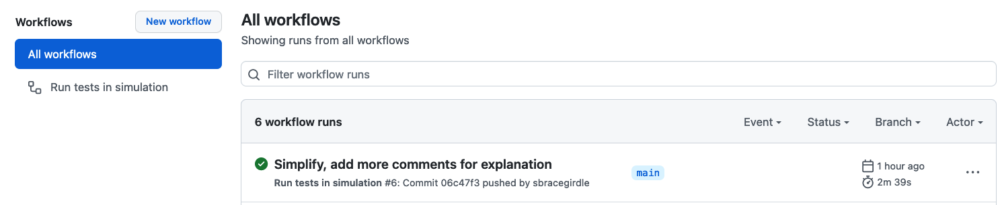
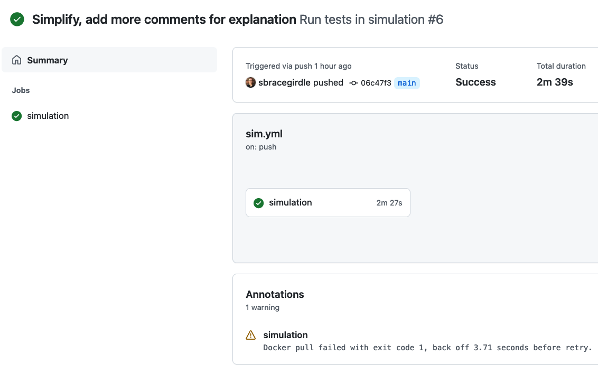
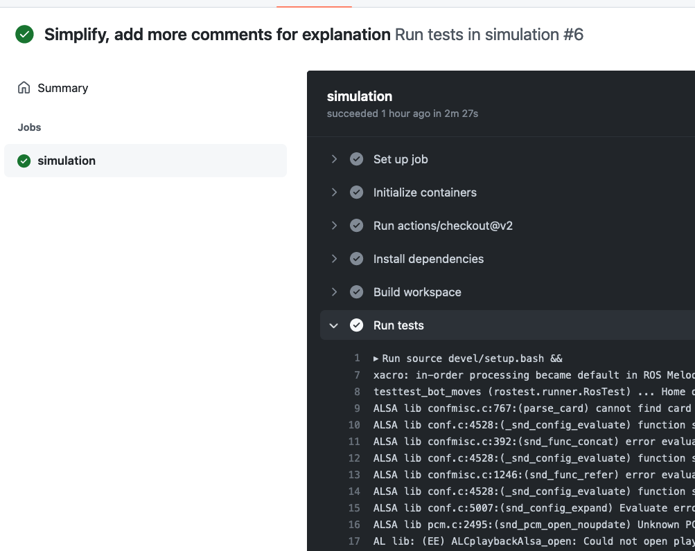

# Creating a robotics simulation pipeline with GitHub Actions and ROS

## Introduction

[GitHub Actions](https://github.com/features/actions) is emerging as a popular and easy to use continuous integration (CI) tool in the industry. It's useful for running all kinds of validation and checks on your code before merging code, or before deployment. For example, you can run; unit tests, static type checkers, linters and code builds.

In this tutorial we'll run a robotics simulation using [ROS](https://www.ros.org/) and [Gazebo](https://gazebosim.org/home) in a Github Actions pipeline, using the [Turtlebot simulation packages](https://github.com/ROBOTIS-GIT/turtlebot3_simulations). We'll start by creating a simplistic robotic movement script and a ROS test script. Then we'll configure the GitHub Actions pipeline and then run it.

## The benefits of GitHub Actions

One of the key benefits of GitHub Actions over alternatives is that it's integrated directly into the GitHub product, which is one of the worlds most popular source code repositories. This means you get build feedback directly in your pull requests, and in your email. For example; if you make a change that causes unit tests to fail, it will prevent you from merging that code in the pull request, and you'll get an email about it.

Another benefit of GitHub Actions is that by default it's fully hosted, meaning you don't need to worry about running servers for your build jobs. GitHub will run your build jobs on their servers for you. On free plans you get a limited number of build minutes for free. On paid or enterprise plans you get more.

In this tutorial we will introduce the basics of GitHub Actions, and show how you can run ROS simulations with Gazebo inside a GitHub Actions CI/CD pipeline.

## What you will need

To setup a simulation in GitHub Actions, you will need:

- A [GitHub](https://github.com) account, with free GitHub action minutes available. [You can sign-up here](https://github.com/join).
- A GitHub repository setup for your project. [Instructions for first-timers here](https://docs.github.com/en/get-started/quickstart/create-a-repo).

This tutorial will assume some [ROS](https://www.ros.org/) and [Python](https://www.python.org/) experience. It's expected that you've used them before and know some of the basic concepts and commands.


## ROS installation and workspace creation

Let's create a directory to house the project and ROS workspace:

```sh
mkdir ros-github-actions-tutorial
cd ros-github-actions-tutorial
```

To follow this tutorial you will need access to a ROS environment. There's two ways that you can do that:

### Option 1) You're running a ROS supported system and are happy to install ROS

If you're running Ubuntu or Debian you can install ROS Melodic by following the installation instructions on the [ROS website](http://wiki.ros.org/melodic/Installation).

### Option 2) You can run ROS in Docker

If you don't have a supported system, or you would prefer not to install ROS on your base OS, you can containerize ROS instead.

After you have [Docker Desktop installed](https://docs.docker.com/desktop/), follow the steps below to run the ROS melodic container:

```sh
docker run -it --name ros-github-actions \
  public.ecr.aws/docker/library/ros:melodic-robot /bin/bash
```

If all goes well, you should get a bash shell inside the container:

```sh
root@de531b44067b:/#
```

## Installing Gazebo and Turtlebot

Having acquired ROS, the next step is to install the Gazebo and Turtlebot packages:

```sh
sudo apt-get update && sudo apt-get install -y ros-melodic-turtlebot3 ros-melodic-turtlebot3-simulations ros-melodic-gazebo-ros-pkgs ros-melodic-gazebo-ros-control
```

## Setting up the ROS project

Now that we have ROS and our dependencies, the next step is to create our ROS project and run it locally. This will allow us to iterate on any changes before pushing it to GitHub to run in the pipeline.

### Create workspace and package

Let's create a ROS workspace and a new package:

```sh
mkdir -p catkin_ws/src
source /opt/ros/melodic/setup.bash
catkin_create_pkg my_turtlebot_sim
```

### Write our robot script

It's time to create the navigation code for our robot! Since this is for demonstration purposes, we'll be naive and command our robot to drive in a straight line.

To start, create the file `catkin_ws/src/my_turtlebot_sim/mover.py`. Then, paste in the following code, which sends a linear velocity command on each 10Hz tick to the robot:

```py
#!/usr/bin/env python

import rospy
from geometry_msgs.msg import Twist

def move():
    """Continuously move the robot by sending velocity commands
    """
    rospy.init_node('robot_mover', log_level=rospy.DEBUG)

    # We want to publish velocity message to the /cmd_vel topic
    velocity_publisher = rospy.Publisher('/cmd_vel', Twist, queue_size=1)

    # Create the velocity message
    vel_msg = Twist()
    vel_msg.linear.x = 1.0

    # Send the message at 10Hz (10 times a second)
    r = rospy.Rate(10)

    while not rospy.is_shutdown():
        # Publish the velocity message each tick
        # so that our robot is continuously moving
        velocity_publisher.publish(vel_msg)
        r.sleep()


if __name__ == '__main__':
    try:
        move()
    except rospy.ROSInterruptException:
        pass
```


### Why test in simulation?

If we working with a more serious robotic code base, it would be valuable to write tests to check the correctness of code before or after merging it with other changes. This can drastically reduce the time to find issues and prevent leakage into live systems.

Unit testing is one approach than can help, but since it verifies functions and components in isolation, it wouldn't verify the effect of the code and robotic system working together.

That's where simulation can come in handy. It enables in-software integration testing of robotics systems.

### Stubbing out the test

Let's show how that process works by writing a test that will run in our simulation environment.

The boilerplate for a [`rostest`](http://wiki.ros.org/rostest/Writing) looks like this:

```py
#!/usr/bin/env python

import unittest

class TestBotMoves(unittest.TestCase):
    def test_movement(self):
        # Test code goes here

if __name__ == '__main__':
    import rostest
    rostest.rosrun('my_turtlebot_sim', 'test_bot_moves', TestBotMoves)
```

To start, paste that boilerplate to a new file at `catkin_ws/src/my_turtlebot_sim/test_bot_moves.py`.

Once we add a launch configuration in a later step, the `test_movement` test will run when we start `rostest` with this script.

### Writing the test logic

In our case, since our robot is all about moving, we want to check that the robot has moved a fixed amount from the spawn point. We'll set a timeout so that if that never happens, the test will fail to give us the feedback we need.

To check if it's moving, we'll write three methods in the `TestBotMoves` class. For the first method, let's save the position of the robot when it moves:

```py
def movement_callback(self, data):
    """Record the robots simulation world position whenever it's
    updated, so that we can check how far it has travelled from
    the spawn point.
    """

    # Find the index of the turtlebot model within all Gazebo models.
    if self.idx is None:
        self.idx = 0
        for name in data.name:
            if name == 'turtlebot3_burger':
                break
            self.idx += 1

    # Save current X/Y position in the sim world
    self.x = data.pose[self.idx].position.x
    self.y = data.pose[self.idx].position.y
```

For the second method, let's run some pythogaras to get the total distance from the spawn point:

```py
def get_distance_from_spawn(self):
    """Use pythagoras to get total distance away from the spawn point
    """
    return math.sqrt(abs(self.x) ** 2 + abs(self.y) ** 2)
```

The third method will be the test method itself, which starts the node, subscribes to Gazebo model state changes, and then continuously checks if the robot has travelled the expected distance:

```py
def test_movement(self):
    """Test that the robot is continuously movement by tracking how
    far it has travelled from it's original spawn point (0,0,0)
    """
    rospy.init_node('test_movement', log_level=rospy.DEBUG)

    self.idx = None
    self.x = 0.0
    self.y = 0.0

    # We're expecting the robot to move this many meters from spawn
    expected_travel = 1.5

    # Subscribe to Gazebo model states, so we can check if our robot moved.
    self.subscriber = rospy.Subscriber(
        '/gazebo/model_states', ModelStates, self.movement_callback)

    # Keep iterating until the robot travels as far as we expect
    travelled = self.get_distance_from_spawn()
    while travelled < expected_travel and not rospy.is_shutdown():
        rospy.loginfo('Travelled; %s m', round(travelled, 1))
        rospy.sleep(1)
        travelled = self.get_distance_from_spawn()

    # The robot has traveled as far as we expect. Test complete!
    assert travelled >= expected_travel
```

### Add the test launch file

To run tests in ROS, we need to create a [`.test`](http://wiki.ros.org/rostest) file, which is a superset of a [`.launch`](http://wiki.ros.org/roslaunch) file. This file describes the nodes to start for the test, and which test to run.

Create this file at `catkin_ws/src/my_turtlebot_sim/my_turtlebot_sim.test`:

```xml
<launch>
  <!-- Specify the variant of turtlebot we want -->
  <arg name="model" default="burger"/>

  <!-- Launch our robot moving script! -->
  <node pkg="my_turtlebot_sim" name="mover" type="mover.py" required="true" output="screen"/>

  <!-- Launch the turtlebot simulation in Gazebo -->
  <include file="$(find turtlebot3_gazebo)/launch/turtlebot3_empty_world.launch">
    <arg name="model" value="$(arg model)"/>
  </include>

  <!-- Run our test script that asserts the robot does what we expect! -->
  <test test-name="test_bot_moves" pkg="my_turtlebot_sim" type="test_bot_moves.py" time-limit="30.0"/>
</launch>
```

You will also need to add this line to the bottom of your `catkin_ws/src/my_turtlebot_sim/CMakeLists.txt` file:

```cmake
if(CATKIN_ENABLE_TESTING)
  find_package(rostest REQUIRED)
  add_rostest(my_turtlebot_sim.test)
endif()
```

You can see my full `CMakeLists.txt` file [here](https://github.com/MechanicalRock/ros-github-actions-tutorial/blob/main/catkin_ws/src/my_turtlebot_sim/CMakeLists.txt).

## Run the test locally

We're now ready to test our sim locally! To launch it, run the following command:

```sh
TURTLEBOT3_MODEL=burger rostest my_turtlebot_sim my_turtlebot_sim.test --text
```

This will launch the `mover.py` node, the Turtlebot sim and our test script.

If everything went well, the test will pass and you should see output like below:

```sh
[INFO] [1653027100.845619, 1.026000]: Travelled; 0.2 m
[INFO] [1653027101.863594, 2.030000]: Travelled; 0.8 m
ok

----------------------------------------------------------------------
Ran 1 test in 3.793s

OK
-------------------------------------------------------------
SUMMARY:
 * RESULT: SUCCESS
 * TESTS: 1
 * ERRORS: 0 []
 * FAILURES: 0 []
```

Nice work! We've completed our robot and simulation. Let's move onto to defining our GitHub Action pipeline.

If you have any issues with your project, please compare your project to the [reference project in GitHub](https://github.com/MechanicalRock/ros-github-actions-tutorial).

## Setting up GitHub Actions

We can use GitHub Actions by defining workflows in yaml files. A [workflow](https://docs.github.com/en/actions/using-workflows) is a process that [triggers](https://docs.github.com/en/actions/using-workflows/triggering-a-workflow) under certain conditions, which we define in the `on` block. When we trigger these conditions, for example by pushing code to a branch, or opening a pull requests, then it executes commands that we define in the `jobs` block.

The [`jobs` block](https://docs.github.com/en/actions/using-jobs/using-jobs-in-a-workflow) defines the graph of processes that need to run in our workflow. Each job can be optionally dependent on other jobs. For example, you may want to run a `deploy` job after running your `build` and `test` jobs. Or you may want to run that job as the first task in the workflow.

In our case, to keep it simple, we will run a single `simulation` job. This job will contain a series of steps which are essentially shell commands. For example; we will first check out the code, then install our package dependencies, then build our project before running the `rostest` for simulation.

To learn GitHub Actions more comprehensively, I highly recommend the [official documentation](https://docs.github.com/en/actions/learn-github-actions/understanding-github-actions).

### Write our workflow yml file

Let's create an empty file under the project root at `.github/workflows/sim.yml`. We'll stub our a GitHub Actions workflow template in this file, which looks like this:

```yml
name: Run tests in simulation

# We only want these changes to run when we push to the main branch
on:
  push:
    branches:
      - main

# Let's default to the burger variant of Turtlebot
env:
  TURTLEBOT3_MODEL: burger
```

Our simulation job needs to run in a ROS container image. We'll also want to run in bash and work within the catkin workspace by default:

```yml
jobs:
  simulation:
    # All steps inside this job will run inside the ROS Melodic container
    container: public.ecr.aws/docker/library/ros:melodic-robot
    runs-on: ubuntu-latest

    # Let's ensure we use bash, and work within our catkin worksapce
    defaults:
      run:
        shell: bash
        working-directory: catkin_ws/

    steps:
      # To be defined ...
```

We need to check out the code and install the Turtlebot and Gazebo simulations:

```yml
jobs:
  simulation:
    # ... Existing code here ... 

    steps:
      # Check out the code
      - uses: actions/checkout@v2

      # Install the Turtlebot and Gazebo packages
      - name: Install dependencies
        run: |
          sudo apt-get update && \
          sudo apt-get install -y \
            ros-melodic-turtlebot3 \
            ros-melodic-turtlebot3-simulations \
            ros-melodic-gazebo-ros-pkgs \
            ros-melodic-gazebo-ros-control
```

Then build the workspace and run the simulation:

```yml
jobs:
  simulation:
    # ... Existing code here ... 

    steps:
      # .... Other steps here ...

      # Build our workspace
      - name: Build workspace
        run: |
          source /opt/ros/melodic/setup.bash
          catkin_make

      # Run our ROS test!
      - name: Run tests
        run: |
          source devel/setup.bash &&
          rostest my_turtlebot_sim my_turtlebot_sim.test --text
```

[You can see the full YML file here.](https://github.com/MechanicalRock/ros-github-actions-tutorial/blob/main/.github/workflows/sim.yml)

### Run the workflow

We've finished our workflow definition, we're ready to commit and push up our code to GitHub and see the action run:

```sh
git add catkin_ws
git commit -m "My first ROS simulation in GitHub Actions"
git push
```

Then open the Actions tab on your repository. For example; https://github.com/MechanicalRock/ros-github-actions-tutorial/actions. You should see a new workflow run for your commit (e.g. "My first ROS simulation in GitHub Actions").



Click on your workflow run to see more details. Click on the `simulation` node to see the details of that job.




From this view you can dig into each of the steps of the job. If all went well then your simulation should succeed, and you'll be able to dig into the output of the "Run tests" step.



If you scroll down the logs, you'll see the following key bits of output indicating that our robot travelled the expected distance:

```sh
[INFO] [1653028456.262115, 0.000000]: Travelled; 0.0 m
[DEBUG] [1653028456.292253, 0.000000]: connecting to 9fff04462213 57261
[DEBUG] [1653028456.292333, 0.000000]: connecting to 9fff04462213 57261
[INFO] [1653028457.382274, 2.729000]: Travelled; 0.2 m
[INFO] [1653028458.386740, 3.730000]: Travelled; 0.8 m
-------------------------------------------------------------
SUMMARY:
 * RESULT: SUCCESS
 * TESTS: 1
 * ERRORS: 0 []
 * FAILURES: 0 []
 ```

Success! Tests are passing.

If you have any issues with your project, please compare your project to the [reference project in GitHub](https://github.com/MechanicalRock/ros-github-actions-tutorial).

## Conclusion

We've run our ROS simulation test in the GitHub pipeline, and were able to verify the output of the test in the GitHub user interface. This gives us greater confidence to merge our code without it causing nasty side effects such as broken builds.

In the real world, you may want to integrate a simulation pipeline step as part of a larger pipeline that includes building, linting, unit testing and deployment. But hopefully, this tutorial gave you a starting point to work with.

If you need help with your pipelines, please feel free to get [in touch with us at Mechanical Rock](https://www.mechanicalrock.io/lets-get-started/).

